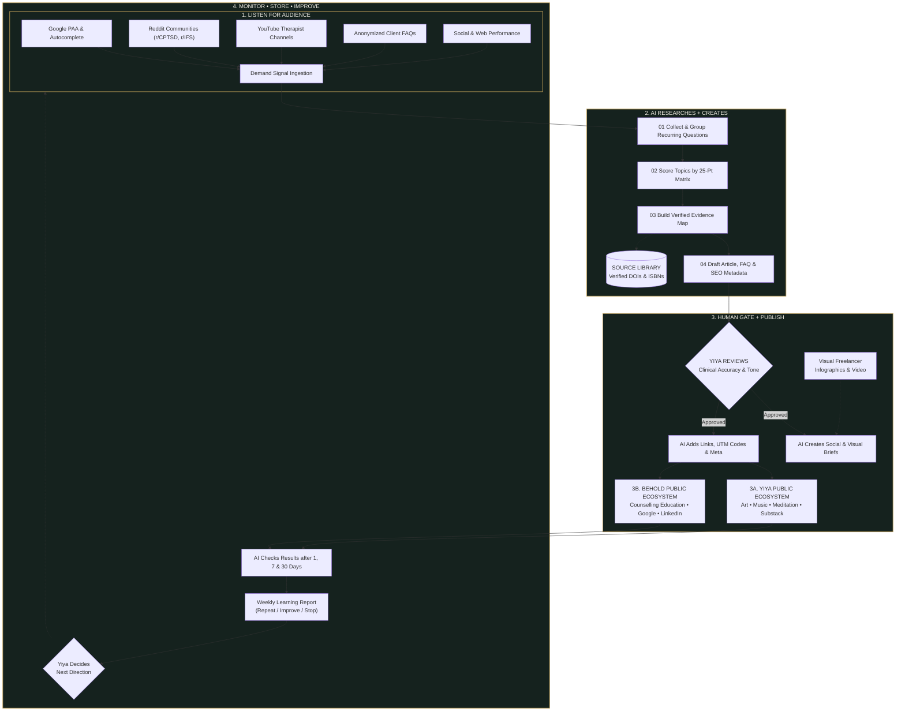

# Behold AI-First Content System
> **"From listening to meaningful connection."**  
> *A human-led automation pipeline for clinical research, publishing, and continuous learning.*

[](https://nodejs.org/)
[](LICENSE)
[](docs/METHODOLOGY.md)

---

## 🌿 Project Overview

The **Behold AI-First Content System** is an end-to-end clinical research and content pipeline designed for **Yiya (Registered Clinical Counsellor)** at **Behold Counselling**.

Unlike generic SEO content generators, this system is built on **clinical precision, zero hallucinated citations, and strict human-in-the-loop governance**. It automates audience research across Google, Reddit, and YouTube, scores opportunities on a 25-point therapeutic matrix, maps verified peer-reviewed evidence (with real DOIs/ISBNs), and coordinates multi-channel publishing across Yiya's and Behold's digital ecosystems.

---

## 🏛️ System Architecture

The architecture mirrors the 4-stage pipeline shown in the master design:



---

## 🚀 Quick Start Guide

### Prerequisites
- **Node.js** >= 18.0.0
- **Gemini API Key** (from [Google AI Studio](https://aistudio.google.com/))
- **CRW Web Scraper** *(optional but recommended)* — for real-time web scraping
  ```bash
  # Self-hosted install (free, no API key needed)
  curl -fsSL https://fastcrw.com/install | sh
  ```
  See [CRW Integration Guide](docs/CRW_INTEGRATION.md) for full setup instructions.

### 1. Installation
```bash
# Clone or navigate to the project directory
cd /media/tinhtran/01D85BC599D1D460/FreeLancer/AI_Automation_Marketing

# Install dependencies
npm install
```

### 2. Environment Configuration
Copy the example environment file and add your Gemini API key:
```bash
cp .env.example .env
```
Edit `.env`:
```env
GEMINI_API_KEY=your_actual_gemini_api_key_here
PORT=3000
```

### 3. Seed Verified Research (Optional)
To instantly populate the database with verified Beta 1 research findings without making API calls:
```bash
npm run seed
```

### 4. Run the Web Dashboard
```bash
npm start
```
Open your browser and visit: **`http://localhost:3000`**

---

## 💻 CLI Commands

You can run each stage independently via CLI or automate them on a cron schedule:

| Command | Description |
|---|---|
| `npm run listen` | **Stage 1:** Scans Google PAA, Reddit (r/CPTSD, r/IFS, etc.), and YouTube for audience questions. Auto-detects CRW for real web scraping. |
| `npm run research` | **Stage 2:** Groups signals, scores topics on 25-pt matrix, builds evidence maps, and drafts articles. |
| `npm run crawl` | **CRW Mode:** Runs CRW-powered web scraping for all listeners. Supports sub-commands: `google`, `reddit`, `youtube`, `search`, `scrape`, `crawl`, `academic`. |
| `npm run seed` | Seeds SQLite database with verified Beta 1 research data. |
| `npm start` | Launches Express server and the web dashboard for Yiya's review. |
| `npm run dev` | Starts server in watch mode for development. |

---

## 📁 Repository Structure

```
.
├── BEHOLD_BETA1_MASTER_PROMPT.md  # Master operational guidelines & system prompt
├── BEHOLD_BETA1_RESEARCH_REPORT.md # Completed research report (manual prototype)
├── First Task.md                  # Project glossary, metrics & psychology profile
├── package.json                   # Project scripts & dependencies
├── server.js                      # Express API server & cron scheduler
├── .env.example                   # Environment configuration template
│
├── docs/                          # Comprehensive Documentation
│   ├── ARCHITECTURE.md            # In-depth system architecture & data models
│   ├── SETUP_GUIDE.md             # Complete step-by-step setup & troubleshooting
│   ├── METHODOLOGY.md             # Research SOP, scoring matrix & anti-hallucination protocols
│   └── CRW_INTEGRATION.md        # CRW web scraper integration guide
│
├── src/
│   ├── config/
│   │   ├── behold-profile.js      # Yiya's clinical profile, modalities & tone rules
│   │   └── glossary.js            # Standardized project terminology
│   │
│   ├── crawlers/                  # CRW Web Scraper Integration
│   │   ├── crw-client.js          # CRW REST API wrapper (scrape, search, crawl, map)
│   │   └── web-researcher.js      # Academic source search & DOI verification
│   │
│   ├── database/
│   │   └── db.js                  # SQLite database layer & schema
│   │
│   ├── listeners/                 # Stage 1: Audience Listening (CRW-enhanced)
│   │   ├── google-paa.js          # Google PAA scanner (CRW search + Gemini fallback)
│   │   ├── reddit-scanner.js      # Reddit scanner (CRW enrichment + JSON API)
│   │   ├── youtube-scanner.js     # YouTube scanner (CRW + YT API + Gemini fallback)
│   │   └── client-faq.js          # Manual client FAQ logger
│   │
│   ├── research/                  # Stage 2: AI Research & Create (CRW-verified)
│   │   ├── topic-collector.js     # Signal aggregator & deduplicator
│   │   ├── topic-scorer.js        # 25-point Behold scoring engine
│   │   ├── evidence-mapper.js     # PubMed & DOI verification engine (CRW-enhanced)
│   │   └── content-drafter.js     # Clinical psychoeducation drafter
│   │
│   ├── publishing/                # Stage 3: Human Gate & Publish
│   │   ├── social-brief-generator.js # Repurposing brief generator (IG, Pinterest, Substack)
│   │   └── utm-linker.js          # UTM campaign tracker
│   │
│   ├── monitoring/                # Stage 4: Monitor & Learn
│   │   └── performance-checker.js # 1, 7, 30-day performance & learning feedback
│   │
│   └── cli/                       # Command-line runners
│       ├── run-listeners.js       # Stage 1 runner (auto-detects CRW)
│       ├── run-research.js        # Stage 2 runner
│       ├── run-crawl.js           # CRW-powered crawling CLI
│       └── seed-data.js           # Database seed script
│
├── public/                        # Web Dashboard (Yiya's Clinical Gate)
│   ├── index.html
│   ├── styles.css
│   └── app.js
│
└── data/                          # Persistent SQLite Database
    └── behold.db                  # (Auto-generated on startup)
```

---

## 🛡️ Clinical Governance & Safety Boundaries

1. **NO Hallucinated Citations:** Every scientific study in the evidence map must have a verified DOI or PubMed record.
2. **NO Invented Metrics:** Demand is evaluated strictly through visible user signals (PAA questions, Reddit upvotes, therapist YouTube engagement).
3. **NO Direct Publishing Without Approval:** The AI can only generate drafts and briefs; Yiya retains 100% editorial authority through the Human Approval Gate.
4. **Canadian English & Trauma-Informed Framing:** Uses Canadian spelling (`colour`, `honour`, `practise`) and normalizes survival adaptations (freeze, fawning, numbing) as protective parts rather than personal failures.

---

## 📖 Additional Documentation

For more in-depth specifications, read our dedicated documentation:
- 📐 **[System Architecture](docs/ARCHITECTURE.md)** — Data schemas, pipelines, and state machines.
- 🛠️ **[Setup & Deployment Guide](docs/SETUP_GUIDE.md)** — Production deployment, API keys, and cron configurations.
- 🔬 **[Research Methodology](docs/METHODOLOGY.md)** — The 25-point scoring rubric and verification procedures.
- 🕷️ **[CRW Integration Guide](docs/CRW_INTEGRATION.md)** — Web scraper setup, API usage, and data flow.
