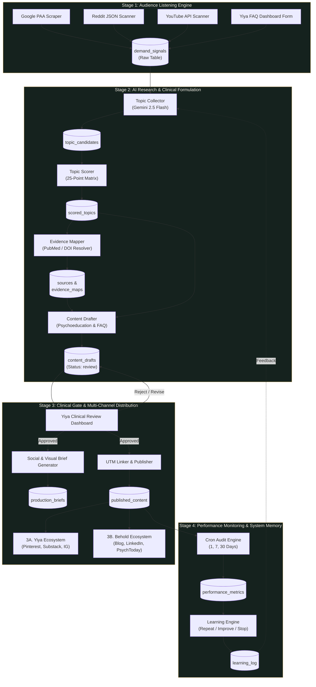

# System Architecture & Technical Specifications
> **Behold AI-First Content System: From Listening to Meaningful Connection**

This document provides the technical architecture, data structures, state machines, and integration patterns for the Behold Content Automation System.

---

## 1. High-Level Architectural Model

The system follows a **Human-in-the-Loop (HITL) Event-Driven Pipeline** divided into 4 sequential stages with continuous feedback loops.

---

## 2. Stage Breakdown & Component Responsibilities

### Stage 1: Listen for Audience
*Objective: Discover unvarnished client questions across search and community forums without guessing or relying on inflated search volumes.*

1. **Google PAA & Autocomplete Scanner (`src/listeners/google-paa.js`)**
   - Synthesizes realistic "People Also Ask" trees and autocomplete variations across Behold's 8 clinical clusters.
2. **Reddit Scanner (`src/listeners/reddit-scanner.js`)**
   - Scans subreddits (`r/CPTSD`, `r/InternalFamilySystems`, `r/GriefSupport`, `r/ADHD`, `r/Anxiety`) via public JSON endpoints.
   - Extracts authentic audience quotes (`"I look fine on the outside but feel hollow inside"`).
3. **YouTube Scanner (`src/listeners/youtube-scanner.js`)**
   - Monitors therapist video trends (e.g., *Therapy in a Nutshell*, *Dr. Tori Olds*, *Patrick Teahan*).
4. **Client FAQ Logger (`src/listeners/client-faq.js`)**
   - Allows Yiya to directly log recurring dilemmas encountered in therapy sessions.

---

### Stage 2: AI Researches + Creates
*Objective: Transform raw inquiries into evidence-backed, clinically sound content candidates.*

1. **Topic Collector (`src/research/topic-collector.js`)**
   - Deduplicates and groups signals by underlying psychological need.
2. **Topic Scorer (`src/research/topic-scorer.js`)**
   - Evaluates each topic on the 25-point Behold Matrix (M1 through M5).
3. **Evidence Mapper (`src/research/evidence-mapper.js`)**
   - Links 8–12 verified academic papers (with DOIs), clinical textbooks (with ISBNs), and audience language quotes.
   - Enforces strict anti-hallucination validation.
4. **Content Drafter (`src/research/content-drafter.js`)**
   - Generates educational article outlines, client FAQs, and internal linking structures formatted for clinical review.

---

### Stage 3: Human Gate + Publish
*Objective: Ensure 100% clinical and brand alignment before anything reaches the public.*

1. **Clinical Review Dashboard (`public/index.html`, `server.js`)**
   - Interactive UI where Yiya approves, edits, or requests revisions on generated drafts.
2. **Social & Visual Brief Generator (`src/publishing/social-brief-generator.js`)**
   - Automatically generates tailored creative briefs for visual freelancers, Instagram carousels, Pinterest pins, Substack letters, and YouTube Short scripts.
3. **UTM Linker (`src/publishing/utm-linker.js`)**
   - Appends standard campaign parameters (`utm_source`, `utm_medium`, `utm_campaign`) ensuring all traffic attribution is measurable.

---

### Stage 4: Monitor + Store + Improve
*Objective: Track engagement at standardized milestones and feed insights back into the topic generation engine.*

1. **Performance Checker (`src/monitoring/performance-checker.js`)**
   - Tracks metrics at 24 hours (Day 1), 7 days (Day 7), and 30 days (Day 30).
2. **Learning Engine**
   - Categorizes each topic cluster into one of three continuous actions:
     - **Repeat:** High engagement/inquiries $\rightarrow$ generate sub-topics in this cluster.
     - **Improve:** Steady engagement $\rightarrow$ refresh with new clinical case studies or FAQ extensions.
     - **Stop:** Weak signal $\rightarrow$ pause topic production in this sub-niche.

---

## 3. Database Schema (SQLite)

The system uses a persistent, high-performance SQLite database (`data/behold.db`) configured in WAL mode:

| Table Name | Primary Purpose | Key Columns |
|---|---|---|
| `demand_signals` | Stores raw scraped search queries, Reddit posts, and YouTube trends | `source`, `cluster`, `title`, `engagement_metric`, `raw_quotes`, `processed` |
| `topic_candidates` | Consolidated content opportunities | `title`, `underlying_problem`, `intended_audience`, `search_intent`, `cluster` |
| `scored_topics` | 25-point evaluation results | `candidate_id`, `m1_audience_relevance` ... `m5_distinctive_angle`, `total_score` |
| `sources` | Persistent library of verified citations | `category`, `authors`, `title`, `doi`, `isbn`, `clinical_takeaway`, `verified` |
| `evidence_maps` | Many-to-many junction linking sources to topics | `scored_topic_id`, `source_id`, `relevance_note` |
| `content_drafts` | Article drafts and FAQs pending Yiya's review | `scored_topic_id`, `draft_type`, `body`, `status` (`draft`/`review`/`approved`) |
| `production_briefs` | Multi-channel briefs generated post-approval | `draft_id`, `brief_type`, `concept`, `copy`, `specifications` |
| `published_content` | Live published links with UTM codes | `draft_id`, `platform`, `url`, `utm_code` |
| `performance_metrics` | 1/7/30-day performance tracking | `published_id`, `check_type`, `views`, `clicks`, `saves`, `inquiries` |
| `learning_log` | Strategic guidance generated by the learning engine | `topic_cluster`, `recommendation` (`repeat`/`improve`/`stop`), `rationale` |

---

## 4. REST API Endpoint Reference

| Method | Endpoint | Description |
|---|---|---|
| `GET` | `/api/stats` | Returns aggregate counts for pipeline dashboard |
| `GET` | `/api/topics` | Returns all topics ordered by 25-point matrix score |
| `GET` | `/api/sources` | Returns all verified peer-reviewed and clinical sources |
| `GET` | `/api/drafts` | Retrieves content drafts (supports `?status=review` filter) |
| `POST` | `/api/drafts/:id/review` | **Human Gate:** Approves draft and triggers brief generation |
| `GET` | `/api/drafts/:id/briefs` | Fetches visual & social production briefs for a draft |
| `POST` | `/api/faqs` | Manually logs an anonymized client FAQ into Stage 1 |
| `POST` | `/api/publish` | Registers a published URL and generates UTM tracking |
| `GET` | `/api/learning-report` | Triggers a performance audit and generates strategic recommendations |
