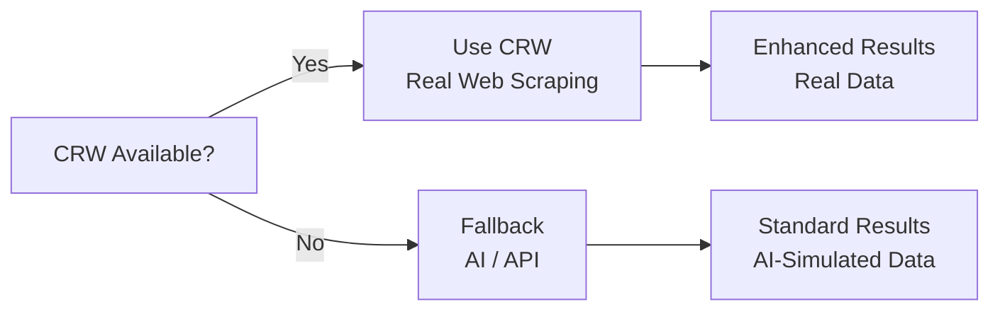
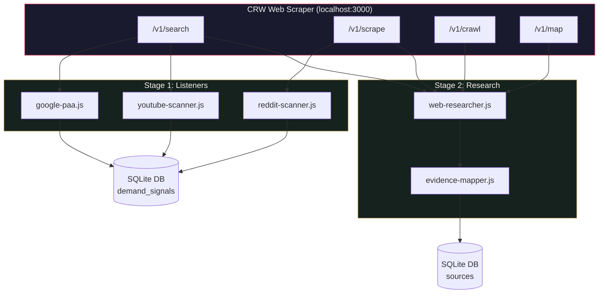

# CRW Web Scraper Integration Guide
> **Behold AI-First Content System: Real-Time Web Scraping with CRW**

This guide details how the Behold Content System integrates with [CRW (fastCRW)](https://github.com/us/crw), a high-performance web scraper and crawler written in Rust. CRW replaces simulated data sources with real web scraping, dramatically improving the quality of audience research and evidence verification.

---

## 1. What is CRW?

**CRW (fastCRW)** is an open-source, self-hosted web scraper and crawler that provides a Firecrawl-compatible REST API. Key features:

| Feature | Description |
|---|---|
| **Scrape** | Extract clean markdown, HTML, or structured JSON from any URL |
| **Search** | Search the web and return ranked results with scraped content |
| **Crawl** | Follow links across a website and collect all pages |
| **Map** | Discover URLs on a site without scraping page bodies |
| **Extract** | Produce structured fields from one or many URLs using LLM |

- **Written in Rust**: Single static binary, ~6 MB RAM idle, 2.3x faster than Tavily
- **Self-hosted**: Runs locally for free — no API key, no rate limits
- **Cloud option**: Managed API at `api.fastcrw.com` with 1000 free credits
- **Firecrawl-compatible**: Drop-in replacement for Firecrawl's `/scrape`, `/crawl`, `/search` endpoints

---

## 2. Installation

### Option A: Self-Hosted (Recommended)

Install the CRW binary directly:

```bash
# One-command install (macOS & Linux)
curl -fsSL https://fastcrw.com/install | sh
```

Start the CRW server (sử dụng port 3002 để tránh trùng với server dashboard port 3000):
```bash
npm run crw
# Hoặc: crw serve --port 3002
```

Configure in `.env`:
```env
CRW_BASE_URL=http://localhost:3002
```

### Option B: Cloud API

1. Register for free at [fastcrw.com/register](https://fastcrw.com/register)
2. Get your API key (starts with `crw_live_...`)
3. Configure in `.env`:

```env
CRW_API_KEY=crw_live_your_key_here
CRW_BASE_URL=https://api.fastcrw.com
```

---

## 3. How CRW Enhances the Pipeline

### Stage 1: Audience Listening

| Listener | Without CRW | With CRW |
|---|---|---|
| **Google PAA** | Gemini *simulates* PAA questions from training data | CRW *searches real Google results* and extracts actual PAA patterns |
| **Reddit** | Public JSON API (basic post text, limited quotes) | CRW *scrapes full thread pages* for richer quotes and comment context |
| **YouTube** | YouTube Data API / Gemini fallback | CRW *searches the web* for YouTube videos (saves YouTube API quota) |

### Stage 2: AI Research & Evidence

| Component | Without CRW | With CRW |
|---|---|---|
| **Evidence Mapper** | Gemini generates citations (risk of hallucination) | CRW *searches PubMed/Google Scholar* for real papers, then *verifies DOIs by scraping DOI.org* |

### Fallback Strategy

Every CRW-enhanced component has a graceful fallback:



If CRW is not installed or not running, the system operates exactly as before — no configuration changes needed.

---

## 4. CRW API Endpoints Used

### POST /v1/search — Web Search

Used by: `google-paa.js`, `youtube-scanner.js`, `web-researcher.js`

```javascript
const result = await crw.search('IFS therapy trauma questions', {
  limit: 10,
  formats: ['markdown'],
});
// Returns: { success, data: [{ url, title, description, markdown }] }
```

### POST /v1/scrape — Single URL Scraping

Used by: `reddit-scanner.js`, `web-researcher.js`

```javascript
const result = await crw.scrape('https://doi.org/10.1037/tra0000541', {
  formats: ['markdown'],
  onlyMainContent: true,
});
// Returns: { success, data: { markdown, metadata: { title, statusCode } } }
```

### POST /v1/crawl — Multi-Page Crawl

Used by: `web-researcher.js`, `run-crawl.js`

```javascript
const result = await crw.crawl('https://example.com', {
  maxPages: 50,
  maxDepth: 2,
  formats: ['markdown'],
});
// Returns: { success, data: [{ markdown, metadata }], total, completed }
```

### POST /v1/map — URL Discovery

Used by: `web-researcher.js`

```javascript
const result = await crw.map('https://example.com');
// Returns: { success, links: ['https://example.com/page1', ...] }
```

---

## 5. Data Flow



---

## 6. CLI Usage

### Run CRW-enhanced listeners
```bash
# Run all listeners with CRW (same as npm run listen, but CRW-aware)
npm run crawl

# Run specific listener
npm run crawl -- google
npm run crawl -- reddit
npm run crawl -- youtube
```

### Direct CRW operations
```bash
# Search the web
npm run crawl -- search "IFS therapy trauma"

# Scrape a single URL
npm run crawl -- scrape https://example.com

# Crawl a website
npm run crawl -- crawl https://example.com

# Search academic sources
npm run crawl -- academic "EMDR treatment PTSD meta-analysis"
```

---

## 7. Source Code Reference

| File | Purpose |
|---|---|
| `src/crawlers/crw-client.js` | CRW REST API wrapper (scrape, search, crawl, map) |
| `src/crawlers/web-researcher.js` | Academic search, DOI verification, competitor analysis |
| `src/listeners/google-paa.js` | Google PAA scanner (CRW + Gemini fallback) |
| `src/listeners/reddit-scanner.js` | Reddit scanner (CRW enrichment + JSON API) |
| `src/listeners/youtube-scanner.js` | YouTube scanner (CRW + YT API + Gemini fallback) |
| `src/research/evidence-mapper.js` | Evidence mapper (CRW verification + Gemini) |
| `src/cli/run-crawl.js` | CRW CLI command runner |

---

## 8. Troubleshooting

| Issue | Cause | Resolution |
|---|---|---|
| `CRW server is not reachable` | CRW binary not running | Chạy `npm run crw` hoặc `crw serve --port 3002` |
| `CRW not configured` | Missing env vars | Thêm `CRW_BASE_URL=http://localhost:3002` vào `.env` |
| `CRW search failed` | Network/API issue | Check CRW logs; verify with `curl http://localhost:3002/health` |
| `DOI verification failed` | DOI.org rate limiting | Wait and retry; CRW handles most rate limits automatically |
| System still uses Gemini | CRW health check fails | Verify CRW is running: `curl http://localhost:3002/health` |
