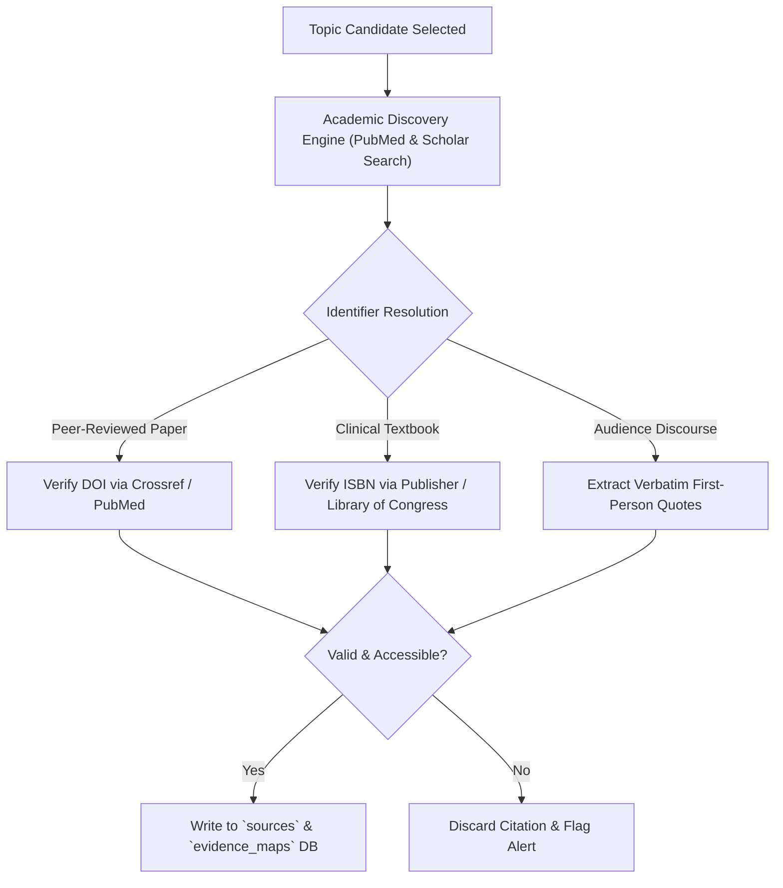

# Clinical Research & Evaluation Methodology
> **Behold AI-First Content System: Standard Operating Procedures (SOP)**

This document details the 25-point scoring rubric, anti-hallucination protocols, prompt engineering standards, and the repeatable research methodology used across the Behold content engine.

---

## 1. The 25-Point Scoring Matrix

Every candidate topic is evaluated across 5 core clinical and market dimensions, scored from **1 to 5** for a maximum score of **25**.

### The 5-Metric Scoring Matrix

| Metric | Question Evaluated | What a Score of 5 Means |
|---|---|---|
| **M1: Audience Relevance** | *Is this a real and important struggle for Behold's ideal clients?* | Closely matches emotionally exhausted, spiritually sensitive adults (mostly women 30–60) seeking trauma-informed support. |
| **M2: Visible Demand** | *Is there documented evidence that people are asking about it?* | Appears repeatedly across Google PAA questions, Reddit threads (r/CPTSD, r/IFS), or therapist YouTube content. |
| **M3: Behold Fit** | *Does this connect strongly with Yiya's clinical specialties?* | Strong, natural integration with IFS, DNMS, EMDR, Somatic Therapy, Mindfulness, and/or spiritually sensitive counselling (see rubric below). |
| **M4: Client Usefulness** | *Would this resource help someone take a safe next step?* | Immediately useful as a client educational handout, FAQ, or grounding resource that reduces repetitive session explanations. |
| **M5: Distinctive Angle** | *Can Behold contribute something more thoughtful than generic articles?* | Clear opportunity to provide a compassionate, parts-based, somatic, and relational perspective that competitors miss. |

### Explicit Behold Fit (M3) 1–5 Rubric

| Score | Clinical Fit Criteria |
|---|---|
| **5 — Excellent fit** | Directly addresses a core Behold specialty, clearly connects with IFS, DNMS, EMDR, somatic or mindfulness work, and would be highly useful to current or prospective clients. |
| **4 — Strong fit** | Closely related to Behold’s specialties and treatment approach, although not central to both. |
| **3 — Moderate fit** | Relevant to general emotional wellness, but the connection to Behold’s specialized trauma and attachment work is limited. |
| **2 — Weak fit** | Only loosely related to Behold’s clients or requires expertise outside the primary practice focus. |
| **1 — Not a fit** | Primarily medical, diagnostic, legal or unrelated to Behold’s counselling expertise and treatment approach. |

### Decision Thresholds
- **21 – 25 Points (Tier 1: Create First):** Immediate priority. Possesses high validation, deep modality synergy, and multi-channel repurposing capacity.
- **17 – 20 Points (Tier 2: Strong Future Topic):** Valuable topic; schedule for secondary publication cycles.
- **13 – 16 Points (Tier 3: Needs Sharper Angle):** Moderate potential; requires narrowing or stronger somatic/IFS framing.
- **$\le$ 12 Points (Tier 4: Do Not Prioritize):** Weak fit or purely generic query; discard.

---

## 2. Anti-Hallucination & Citation Protocol

To preserve Yiya's professional standing as a Registered Clinical Counsellor (RCC), the system enforces strict safeguards against synthetic or hallucinated citations:

### Citation Standards by Category:
1. **Peer-Reviewed Research:** Must contain authors, title, journal name, year of publication, and a verifiable Digital Object Identifier (DOI).
2. **Clinical Frameworks / Books:** Must contain author, title, recognized publisher, year, and a valid International Standard Book Number (ISBN).
3. **Audience-Language Sources:** Must be clearly marked as qualitative lived-experience discourse from public forums, never mislabeled as clinical evidence.

---

## 3. Brand Voice & Clinical Tone Guidelines

Every prompt incorporates the Behold Clinical Profile (`src/config/behold-profile.js`):

### Core Principles:
- **Warm Clinical Clarity:** Write like a compassionate clinician speaking directly with a client — clear, grounded, and validating.
- **Normalize Survival Adaptations:** Frame symptoms (numbness, hypervigilance, fawning, dissociation) as intelligent, learned protective strategies rather than personal defects.
- **Bottom-Up Integration:** Acknowledge that trauma lives in the nervous system and body, not merely cognitive thoughts.
- **Spiritual Sensitivity:** Hold space for doubt, spiritual dryness, and existential questions with nuance, avoiding dogma or superficial reassurance.
- **Canadian English Standards:** Enforce Canadian spelling conventions (`colour`, `honour`, `practise`, `centre`).

### Banned Terminology:
- ❌ Generic platitudes (*"Just breathe"*, *"Practice gratitude"*, *"Think positive"*)
- ❌ AI filler (*"In today's fast-paced world"*, *"Let's dive into"*, *"In conclusion"*)
- ❌ Medicalized diagnostic jargon without clinical translation

---

## 4. Repeatable 6-Step Research SOP

When researching any new topic cluster, follow this exact workflow:

1. **Define Cluster (15 min):** Select one of Behold's 8 clinical clusters.
2. **Mine Demand Signals (60–90 min):**
   - Query Google PAA and autocomplete trees for recurring patterns.
   - Scan subreddits (`r/CPTSD`, `r/InternalFamilySystems`) for verbatim quotes.
   - Check therapist channels on YouTube for high-engagement video themes.
3. **Score Topic (15 min):** Run the 25-point scoring engine against the matrix.
4. **Source Evidence Map (90–120 min):** Identify 4–5 peer-reviewed studies (DOIs) and 3–4 clinical texts (ISBNs).
5. **Formulate Behold Angle (30 min):** Synthesize the IFS parts, somatic freeze, and spiritual layers.
6. **Clinical Review & Approval (15 min):** Yiya inspects the draft in the web dashboard before generating production briefs.
